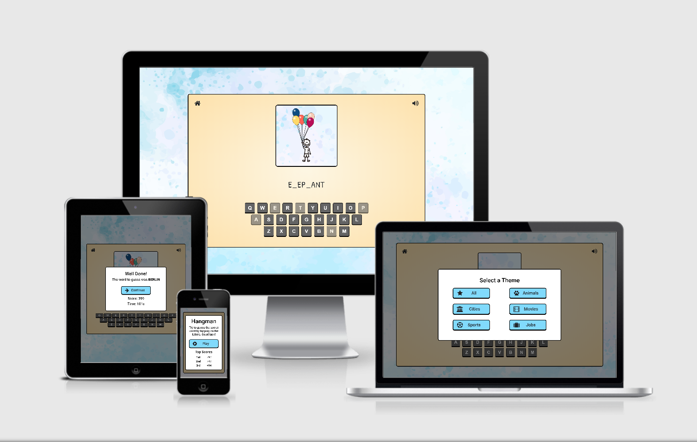

# The Hangaman Game

This is a digital version of the classic paper-and-pencil game, restyled to be more child-friendly.

## UX

The goal of the project was to create a game that is both nostalgic for adults and educational for children, but without the questionable taste of the original one. 
 
### User Stories

As a player aged between 6 to 99 years old I want to:

1. The ability to intuitively understand how to play the game.  
2. The ability to choose different themes in which to play.
3. A combination of visual and audio feedback after each move to make the game more engaging.
4. A mute button to remove the sounds effect, in case they become annoying.
5. The ability to see my top scores, so I can try to beat them.
6. The ability to play on my smartphone as well as my tablet and my laptop.

### Design Choices

1.  **Fonts**
All fonts are from [Google Fonts](https://fonts.google.com/).
    - The site's main font is **Roboto**, it was chosen for its clear and straight design.   
    - The font of the word to guess is **Patrick Hand**, it was chosen because of its resemblance to handwriting.
    - The font used in the on-screen keyboard is **Helvetica**, as it is commonly used in real keyboards.

1.  **Buttons**
The buttons style is from [Bootstrap](https://getbootstrap.com/).
    - Large call-to-action buttons are used in all modals to guide the flow of the game.
    - Each modal button contains a [Font Awesome](https://fontawesome.com/) icon that represents its meaning, this makes site navigation more intuitive and also makes the site's appearance more playful.
    - The on-screen keyboard is designed to look like an android keyboard with dark theme
    - The shadow under the buttons narrows when clicking, giving the illusion that the button is pushed down.

1.  **Colours** 
The site uses light, pastel colors with good contrast between them.
    - Sky blue (#81DAFC) is used as default button color, it was chosen because it is a more pastel version of the bootstrap primary button. The same color is used as fallback for the background.    
    - Bright orange (#D35400) is used to highlight the buttons when the user hovers them with the mouse, it creates a nice contrast with the idles buttons.    
    - Yellow paper (#FDF6E3 to #fde1ab) are used to create the effect of old paper, to give the feeling of the paper-and-pencil game.

1.  **Hangman Figure** 
The hangman figure was created by the author from free images with [Paint.net](https://www.getpaint.net/).
    - In the original game, a hanged man is gradually drawn each time the player chooses a wrong letter. In this version he is replaced by a flying kid "hanging" on balloons. The idea is to remain consistent with the name of the game and at the same time make the image more suitable for children.
    - The project aims to create a fully responsive game, one of the greatest challenges in this regard has been to make the image size consistent with extremely different width/height ratio viewports. 

1.  **Sound Effects** 
All sound effects are from [Freesound](https://freesound.org/).
    - A positive sound is played if the player chooses a correct letter, the sound style reminds the old arcade video games and contributes to creating a nostalgic atmosphere as well as to make the game more interactive.    
    - A "Pop" sound is played if the player chooses a wrong letter, creates the illusion that one of the balloons in the image has burst.

1.  **Background** 
The background image is from [Freepik](https://www.freepik.com/).
    - It was chosen because it looks like a painted sky and creates a good contrast with the yellow of the gameplay page.

1.  **Styling** 
The website style is inspired by [PicFlip!](https://ajgreaves.github.io/picflip/)
    - Most buttons and containers were given black thick border and rounded corners to make them look more cartoonish.
    - The title and the "New Record" signal are animated using [Textillate](https://textillate.js.org/).

### Wireframes

The wireframes were creating using Figma and can be found [here](https://www.figma.com/file/W6byLl333Stnds9vzlbSOB/Second-milestone-project?node-id=8%3A23).

## Features

The website use a one page design with modals that are shown at appropriate times based on user interaction.
 
### Existing Features

1. **Landing Modal**
Appears as soon as the user enters the site.
	- _Ainmated Title_: A subtle animation distinguishes the title from other headers.
	- _Introduction_: Show the user a brief description of the game.
	- _Play Button_: Allows the user to start a new game.
	- _Top Scores_: Allows the user to see his previous three top scores.
 
 2. **Selection Modal**
Allows the user to choose the category in which to play.
	- _Theme Buttons_: Allows the user to choose from 5 themes in which to play. Alternatively, the "All" button combines all the themes together.

3. **Gameplay Page**
The page where the game takes place.
	- _Home Button_: Allows the user to return to the Landing Modal.
	- _Audio-Toggle Button_: Allows the user to enable / disable sound effects.
	- _Hangman Figure_: It's the graphic component of the game as well as the main visual feedback. Occupies the top third of the page
	- _Word to Guess_: Initially hidden, but gradually revealed as the user guesses the letters. It is the element in which the user's attention is focused and therefore occupies the center of the page.
	- _On-screen Keyboard_: It occupies the lower third of the page, a familiar position when playing on a mobile phone.

4. **Results Modal**
Appears at the end of the game and shows the results.
	- _Game Outcome_: Shows two possible messages, one for victory and one for defeat, and in the latter case lets the player know which was the word to guess.
	- _Continue Button_: Allows the user to return to the Landing Modal. 
	- _Game Score_: Show the score and time of the game just played. An animated signal informs the user if the score is a new record
	
### Features Left to Implement

1. **Global Leaderboard**
At present the game saves the player's best scores in the browser. The next step is to create a global leaderbord with the best scores of all players saved on a server. To do this I need to develop back-end skills not yet covered in the course.

2. **Additional Words to Guess**
Currently in the game there are 165 words to guess contained in arrays. It's possible to increase game longevity by increasing the number of words and storing them in JSON files, more suitable than arrays to contain large quantities of elements.

3. **Multiplayer**
It would be interesting to introduce a two player mode, where one chooses a word and the other has to guess it.

### Remouved Features

1. **Tutorial**
In the wireframes, the project included a detailed description of how to play, I decided to remove it during development becouse people don't like tutorials and walls of text are even worse. On the other hand I tried to make learning the game as simple and intuitive as possible.

## Technologies Used

- **Languages**
    - [HTMLS](https://devdocs.io/html/) 
    - [CSS3](https://devdocs.io/css/) 
    - [JavaScript](https://devdocs.io/javascript/) 

- **Libraries**
    - [JQuery](https://jquery.com) was used to simplify DOM manipulation.
    - [Google Fonts](https://fonts.google.com/) was used to import the fonts used in the website.
    - [Animate.css](https://daneden.github.io/animate.css/) was added as dependency of Textillate

- **Frameworks**
    - [Bootstrap](https://getbootstrap.com/) was used extensively to create the responsive design, in particular the grid and the modal classes.

- **Plugins**
    - [Textillate](https://textillate.js.org/) was used to animate the title and the "New Record" signal.
    - [Lettering.js](http://letteringjs.com/) was added as dependency of Textillate

- **Toolkits**
    - [Font Awesome](https://fontawesome.com/) was used to create button icons.

- **API**
    - [Web Storage](https://www.w3schools.com/html/html5_webstorage.asp) was used to save scores in the leaderbord.

- **Services**
    - [GitPod](https://www.gitpod.io/) was the main IDE in which the project was developed.
    - [Git](https://git-scm.com/) was used for version control during the development process.
    - [GitHub](https://github.com/) was used to host the project in a remote repository.
    - [Chrome DevTools](https://developers.google.com/web/tools/chrome-devtools) was used to test responsiveness and quickly debug code.
    - [HTML Validator](https://validator.w3.org/) was used to test the HTML code.
    - [CSS Validator](https://jigsaw.w3.org/css-validator/) was used to test the CSS code.
    - [JSHint analysis](https://jshint.com/) was used to test the JavaScript code.
    - [Autoprefixer](https://autoprefixer.github.io/) was used to add prefixes in the CSS for cross-browser support.
    - [Figma](https://www.figma.com/) was used for wireframing
    - [Online Audio Converter](https://online-audio-converter.com/it/) was used for simple sounds manipulation.
    - [Responsive Design](http://ami.responsivedesign.is/) was used to take the screenshot at the beginning of this document

- **Software**
    - [Paint.net](https://www.getpaint.net/) was used for simple images manipulation.
    - [Visual Studio Code](https://code.visualstudio.com/) was used for testing snippet of JS code.

## Testing

In this section, you need to convince the assessor that you have conducted enough testing to legitimately believe that the site works well. Essentially, in this part you will want to go over all of your user stories from the UX section and ensure that they all work as intended, with the project providing an easy and straightforward way for the users to achieve their goals.

Whenever it is feasible, prefer to automate your tests, and if you've done so, provide a brief explanation of your approach, link to the test file(s) and explain how to run them.

For any scenarios that have not been automated, test the user stories manually and provide as much detail as is relevant. A particularly useful form for describing your testing process is via scenarios, such as:

1. Contact form:
    1. Go to the "Contact Us" page
    2. Try to submit the empty form and verify that an error message about the required fields appears
    3. Try to submit the form with an invalid email address and verify that a relevant error message appears
    4. Try to submit the form with all inputs valid and verify that a success message appears.

In addition, you should mention in this section how your project looks and works on different browsers and screen sizes.

You should also mention in this section any interesting bugs or problems you discovered during your testing, even if you haven't addressed them yet.

If this section grows too long, you may want to split it off into a separate file and link to it from here.

## Deployment

This website was deployed on GitHub from the master branch, it can be accessed from the following Url: https://github.com/Dom-888/Second-Milestone-Project

The exact procedure is as follows:
1. Log in to Github
2. Select the repository you want to deploy
3. Under the repository name, click **Settings**.
4. Under "GitHub Pages", use the Source drop-down menu and select the master branch.
5. The message "Your site is ready to be published at *Link* will 
   appear under Github Pages.

In case you want to pull the code from my Github repository:
1. Log in to Github,
2. Navigate to the main page of the repository or click https://github.com/Dom-888/Second-Milestone-Project
3. Under the repository name, click **Clone or download**.
4. To clone the repository using HTTPS, under "Clone with HTTPS", click the clipboard icon. To clone the repository using an SSH key, including a certificate issued by your organization's SSH certificate authority, click **Use SSH**, then click the clipboard icon.
5. Open Git Bash.
6. Change the current working directory to the location where you want the cloned directory to be made.
7. Type git `clone`, and then paste the URL you copied in Step 3.
8. Press **Enter**. Your local clone will be created.

## Credits

### Code

- The code to center the page vertically is from [this](https://medium.com/wdstack/bootstrap-4-vertical-center-1211448a2eff) article.

### Media

- The background image was created by **Hello-Pixel** and was downloaded from [Freepik](https://www.freepik.com/).
- The "Pop" sound was created by **Greenvwbeetle** and was downloaded from [Freesound](https://freesound.org/).
- The "Success" sound was created by **Shinephoenixsto** and was downloaded from [Freesound](https://freesound.org/).
- The image of the kid was obtained from [this](https://paintingvalley.com/family-drawing-stick-figures#family-drawing-stick-figures-2.jpg) image, the author is unknown.

### Acknowledgements

- I received assistance, feedback and encouragement from my mentor [Seun Owonikoko](https://github.com/seunkoko).
- I received help and suggestions from [Code Institute](https://codeinstitute.net/) tutors.
- The project code has been reviewed by the [Code Institute](https://codeinstitute.net/) Slack community.
- This project takes inspiration from [PicFlip!](https://ajgreaves.github.io/picflip/) by [Anna Greaves](https://github.com/AJGreaves).

 

#### Disclaimer

The content of this Website is provided for educational purposes only.

